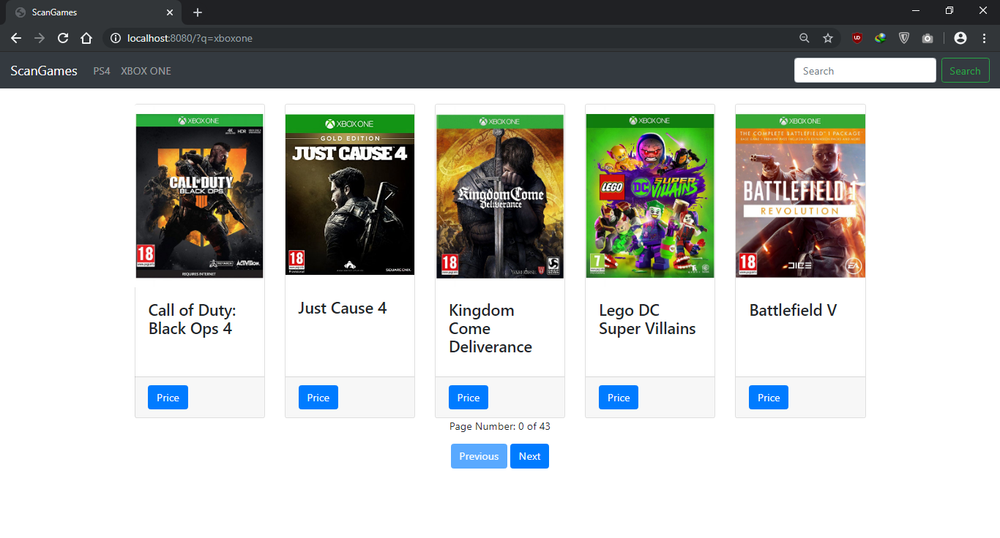

# Price Comparison Website

## Description of the project
This is a price comparison website, that compares video games PS4 and Xbox One, from five different websites.   
* The Website scraping was done in Java with Maven, Hibernate, Spring and JSoup.
* MySQL was used to store the data.
* The back end of the website was implemented in JavaScript running on Node.js.
* The front end was written in HTML, CSS, JavaScript, Vue, Axios and Bootstrap.

List of websites:
* SimplyGames
* Ebay
* Argos
* Onbuy
* Base

## Screenshots of the website:

Homepage

PS4 page

XBOX ONE page

Battlefield V PS4 game page

Fifa 19 XBOX ONE game  page

Search game FIFA 19

